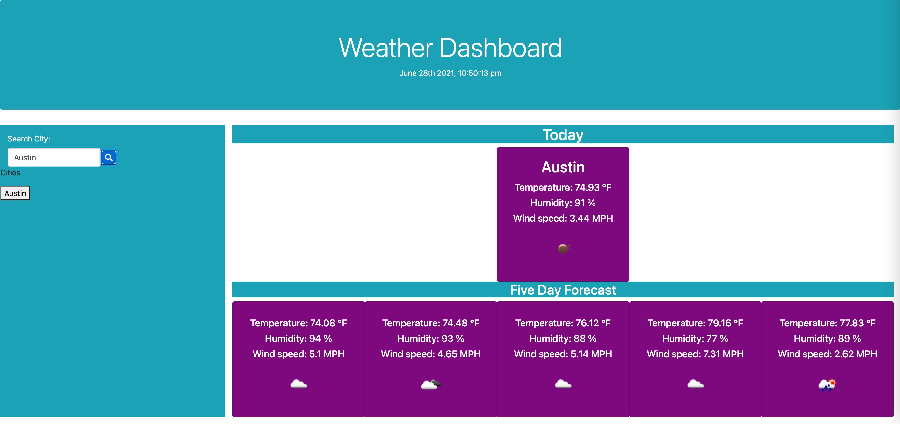

# Weather Dashboard

# Description

This app allows the user to search for a city and see the current weather in real time, and the weather forecast for the next five days. It utilizes Open Weather API. The user can see the current temperature, humidity, wind speed, current weather icon. In the current weather card the user can also see the UV Index. 

## Deployed App link 

https://blen90.github.io/weather-dashboard/

## Screenshots of the app

# Table of Contents

* [Installation](#installation)
    
* [Usage](#usage)

* [Technology](#technology)

* [License](#license)

* [Contributors](#contributors)

* [Questions](#questions)

# Installation

Visit the deployed app in the following link: https://blen90.github.io/weather-dashboard/

# Usage

This application allows the user to search for a city and see the current weather and the weather forecast for the next five days.

# Technology

* HTML
* JavaScript
* Open Weather API
* CSS

# License 

This project is governed by: MIT License

# Contributors

Blenda Orellana

# Questions

If you have any questions about the repo or the app please feel free to contact me
 * Email: blen.or90@gmail.com
 * Github: https://github.com/blen90
